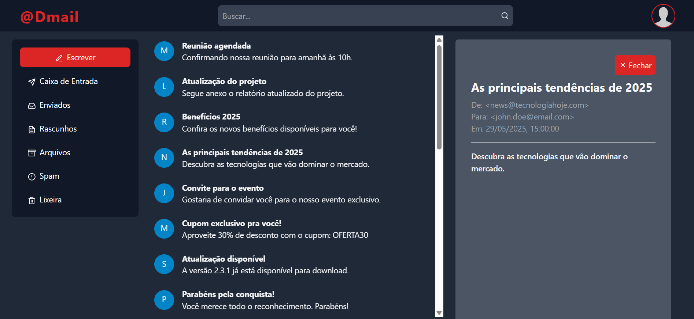

# 📬 @Dmail

**@Dmail** é uma plataforma de e-mails construída com React e Tailwind CSS, simulando uma caixa de entrada moderna com uma interface responsiva e clara.

## 🧰 Tecnologias Utilizadas

- **React.js**
- **Tailwind CSS**
- **React Icons**
- **JavaScript (ES6+)**
- **JSON (dados simulados de e-mails)**

## ✨ Funcionalidades

- 📥 Lista de e-mails simulada a partir de um arquivo JSON
- 📄 Visualização do conteúdo completo de um e-mail
- ✅ Responsividade para diferentes tamanhos de tela (mobile, tablet, desktop)
- 🧭 Barra lateral de navegação
- 📱 Barra inferior adaptada para mobile
- ❌ Botão para fechar o conteúdo do e-mail

## 🖼️ Layout

A interface é inspirada em plataformas de e-mail modernas como Gmail e Outlook, com foco em **clareza**, **organização** e **boa experiência de leitura**.

## Próximos Passos (ideias para evoluir)

- ✨ Tema claro
- 🔍 Barra de busca para filtrar e-mails
- 📨 Composição de novo e-mail
- 🗑️ Lixeira e arquivamento
- ✅ Marcar como lido/não lido
- 🔐 Integração com back-end e autenticação
